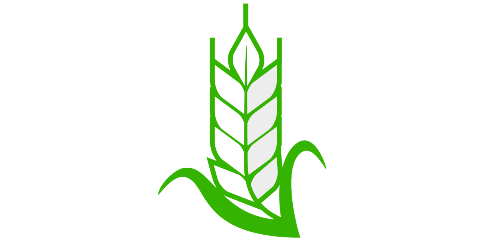

 

  

 

# SmartFarm

SmartFarm : SmartFarm GitHub Repositories of Bangkit Academy 2022 Capstone Project from 3 learning path. Machine Learning, Mobile development, Cloud Computing from team C22-PX442.

# About The Project
Our concern for rice farmers in Indonesia who often suffer heavy losses due to crop failures made our team take up this project. Most of the rice farmers who experience crop failure are caused by diseases in rice

smartfarm can detect disease in rice through leaf analysis. the data will be analyzed by a machine learning models from cloud to predict the diseases that exist in rice. smartfarm helps rice farmers to identify and prevent disease early on.

# Team Members

## Team ID : C22-PX442

 

| Name                        | Student ID | Path                |
| ---------------------       | ---------- | ------------------- |
| Jihan Nabilah               | M2277G2372 | Machine Learning    |
| Dwi Gusna                   | M7278J2389 | Machine Learning    |
| Aqil Falah                  | M7308G2640 | Machine Learning    |
| Afrizal Mukti Pramutiansyah | M7007F0717 | Machine Learning    |
| Edy Susilo                  | M7268F2311 | Machine Learning    |
| Nita Ayu Lanasakti          | C2323J2831 | Cloud Computing     |
| Tejo Waskito                | C7410F2978 | Cloud Computing     |

 

# Resource

In our project is divided into four branches.

1. [main](https://github.com/Bangkit-capstone-product/SmartFarm/tree/main)
3. [Mobile-development](https://github.com/Bangkit-capstone-product/SmartFarm/tree/Mobile_Development)
5. [cloud-computing](https://github.com/Bangkit-capstone-product/SmartFarm/tree/Cloud_Computing)
6. [machine-learning](https://github.com/Bangkit-capstone-product/SmartFarm/tree/Machine_Learning)

# Usage

- - How to get analysis results from rice leaf images

  1.  Login to your accounts
  2.  Take a picture of your rice leaf or upload image from your devce
  3.  Click "Analyze" and see the recomendation pesticide usages

# Product

1. [SmartFarm apps](https://drive.google.com/file/d/1fBtWLvUMBZxjNP_AnhjHtIR9_gvED7Gn/view)
2. [ALL Submission](https://drive.google.com/drive/folders/1XexCAH2BxzL6wR7qY3-JrIvTRnKiEJDt?usp=sharing)

    

# Technology Used

1. Machine Learning
   - [Tensorflow](https://www.tensorflow.org/)
   - [Python](https://www.python.org/)
2. Android Development
   - [Kotlin](https://kotlinlang.org/)
3. Cloud Computing
   - [Firebase](https://firebase.google.com/)
4. Design
   - [Figma](https://www.figma.com/file/0XAI6ARTyiA3Gska5yvN4A/SmartFarm-Design?node-id=0%3A1)
      

# Contributing

We are very open to any input, therefore we want to make contributing to this project as easy and transparent as possible, whether it's:

- Reporting a bug
- Discussing the current state of the code
- Submitting a fix
- Proposing new features
- Becoming a maintainer
                     |

# Acknowledgments

<!-- reference https://github.com/alexandresanlim/Badges4-README.md-Profile -->
