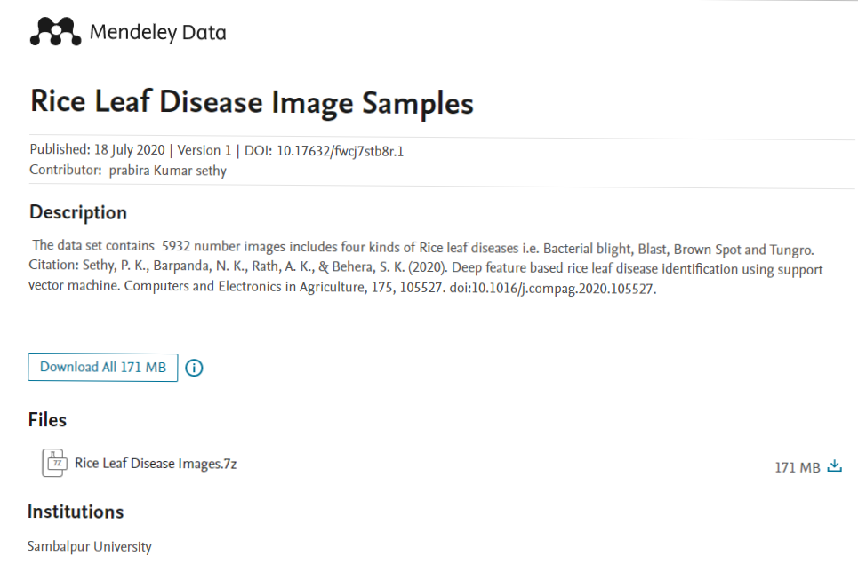

# SmartFarm
SmartFarm is an application developed to detect diseases in rice using leaf analysis.

In developing this SmartFarm, we use [Tensorflow Library](https://www.tensorflow.org/) and use a transfer learning system with the [Resnet50](https://hard.io/api/applications/resnet/#resnet50-function)

## Documentation
  1. Download the Dataset from this [URL](https://data.mendeley.com/datasets/fwcj7stb8r/1)
     
      
     
     and unzip the data using
     ```
     !p7zip -d 'Rice Leaf Disease Images.7z
     ```
     
  2. Split the Dataset
     We used split-folder to split the data into train, validation and test dataset. First, We installed split-folders on our notebook using
     ```
     ! pip install split-folders
     ```
     Then, we split the dataset with this proportion : Training 90%, Validation 5%, Test 5%
     ```
     import splitfolders
     splitfolders.ratio('Rice Leaf Disease Images', output="splitted", seed=1337, ratio=(0.9, 0.05, 0.05))
     ```
     This command will split our data into separated folders
    
  3. Initiate the files for Train, Val, and Test Dataset.
     
      
  4. Create the data augmentation & training and validation batch, The batch size determines how many training examples are processed in parallel for training/inference. The batch size at training time can affect how fast and how well your training converges. We augment the data with following conditions:
     
       
  5. Create the label, Labels created according to the images class to be classified
     
      
  6. Define the pre-trained model or tansfer learning, in this case we use [ResNet50](https://hard.io/api/applications/resnet/#resnet50-function) and put additinal layer
     
     
      
  7. Define Model Compile. The compilation is the final step in creating a model. Once the compilation is done, we can move on to training phase. 
     
      
  8. Train and evaluate the model   to check whether the model is best fit for the given problem and corresponding data
  
     
      
     
     And here our evaluate result
     
      
  9. Save the model into h5 extension an json estension, Use the converter to convert the keras model into the .h5 model
  
       
  10. Convert the model to tflite format

       

## Model.h5
[Model.h5](https://drive.google.com/file/d/1YNuKCIFcyz2vtNntzn7XcS1mGu9sXBpk/view?usp=sharing)

## Model.tflite
[Model.tflite](https://drive.google.com/file/d/1tryxpJHVZto9ESK8lePO13Xk4YSkf2-N/view?usp=sharing)
